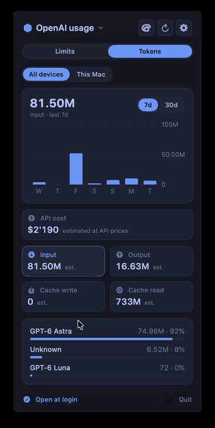

# Mr. Usage

A macOS menu bar app for Claude and OpenAI usage. See your plan limits, token counts,
and estimated API costs without leaving your desktop.

**[Download for macOS](https://github.com/t1llo/mr-usage/releases/latest)** ·
**[Website & leaderboard](https://usage.beffa.xyz)**

## Features

- **Live plan limits** for Claude Code and ChatGPT plans used through Codex or OpenCode,
  with reset countdowns and markers showing your pace through each window.
- **Token charts** with input, output, cache reads, cache writes, and a per-model breakdown.
- **API-equivalent costs** calculated from published model prices, separate from your subscription bill.
- **OpenAI credit balance** for additional usage, including promotional credits reported by your account.
- **Local usage** from Claude Code, Codex, and OpenCode, plus an OpenAI **All devices** view.
- **Three themes:** Tokyo Night, Catppuccin Mocha, and Catppuccin Latte.
- **Optional leaderboard sharing** at [usage.beffa.xyz](https://usage.beffa.xyz), off by default.
- **Automatic updates** and **Open at Login**.

## Demo

[](docs/assets/mr-usage-demo.mp4)

[Watch the full-quality recording](docs/assets/mr-usage-demo.mp4) · 19 seconds

## Install

Requires **macOS 13 or later**. Downloads support **Apple Silicon and Intel**.

1. Download **Mr-Usage-macOS.dmg** from the [latest release](https://github.com/t1llo/mr-usage/releases/latest).
2. Open it and drag **Mr. Usage.app** into **Applications**.
3. Launch the app and click its percentages in the menu bar.

Published apps are Developer ID-signed and notarized by Apple. A ZIP download and
SHA-256 checksums are also available on each release.

Sign in through **Claude Code**, **Codex**, or **OpenCode** first. Mr. Usage reuses those
existing logins; there is no separate provider login to configure in the app.

### Automatic updates

Sparkle checks for updates hourly and can download them automatically for installation
when the app quits. The footer's download-circle menu has **Check for Updates…** and
automatic-update preferences. Choose **Install and Relaunch** when an update is offered.

Update feeds and archives are verified with an embedded public EdDSA key. GitHub releases
must be publicly accessible for the updater to download them. Builds without Sparkle
need a one-time manual installation of a current release.

## Using the app

Choose **Claude** or **OpenAI** in the provider picker. Both have two tabs:

| Tab | What it shows |
| --- | --- |
| **Limits** | Session and weekly usage, reset times, pace markers, and extra-usage credits where available. OpenAI also shows recent plan windows. |
| **Tokens** | Usage charts, totals, estimated API cost, and a model breakdown. OpenAI offers **This Mac** and **All devices** views. |

Click a token or cost total to chart it. The palette button changes the theme.
The gear beside Refresh opens **Settings**; click either usage tab, **×**, or press
**Escape** to return. The panel keeps its size between pages and scrolls without visible scrollbars.

Enable **Open at Login** after moving the app to its permanent location in Applications.
Only one instance runs at a time.

## How usage is collected

### Claude

- **Limits:** reads the `Claude Code-credentials` macOS Keychain item through
  `/usr/bin/security`, then calls the same usage endpoint as Claude Code's `/usage`.
- **Tokens:** reads local transcripts under `~/.claude/projects` and Anthropic messages
  in OpenCode's database. Repeated or streamed copies of a response are counted once.
  These counts cover this Mac, not claude.ai or other computers.
- **Costs:** uses the model's API list prices, including cache reads, 5-minute and 1-hour
  cache writes, and fast mode where recorded.

### OpenAI

- **Limits:** uses an unexpired Codex token from `$CODEX_HOME/auth.json` (default
  `~/.codex/auth.json`), then OpenCode's ChatGPT OAuth token. If live limits are unavailable,
  the app can show Codex's most recent logged snapshot with its timestamp. Windows whose
  reset time has passed are cleared.
- **Credits:** displays OpenAI's usage-credit balance in the Limits tab, including granted
  credits reflected in that balance. Credits are used after included plan usage and are shown
  in credit units. The newest available live or logged balance is shown with its timestamp;
  this is separate from dollar-denominated API cost estimates.
- **This Mac:** counts Codex session and archived-session logs plus OpenAI messages in
  OpenCode's database. Per-response records take precedence over running totals; copied
  responses and forked OpenCode sessions are deduplicated.
- **All devices:** uses ChatGPT's daily account history across CLI, IDE, app, cloud, and
  other machines. The service supplies daily totals and model shares, so input/output/cache
  splits and costs are **estimates**. They use this Mac's Codex mix when at least 1M tokens
  are available, otherwise a typical mix of 88% cache reads, 10% uncached input, and 2% output.
- **Costs:** uses OpenAI Standard-tier list prices for prompts under 272K tokens, recomputed
  from counts even when OpenCode records a ChatGPT subscription's cost as zero.

OpenCode data is read from `opencode*.db` under `$XDG_DATA_HOME/opencode`
(default `~/.local/share/opencode`), including SQLite WAL data. Provider tokens are never
refreshed by Mr. Usage; Codex and OpenCode manage their own logins.

### Timing and limitations

- Local logs are scanned every minute. New installations need a first request before token counts appear.
- Claude live requests start at one-minute intervals; OpenAI live requests at two-minute intervals.
- Rate limits and server errors increase the interval up to ten minutes, honoring longer
  `Retry-After` delays. Manual refresh follows the same gates. Failures preserve the last good data.
- OpenAI account history is daily-aggregated: today can be missing and plan history can lag
  live usage by a day. Successful history fetches are cached for ten minutes.
- Codex's experimental compressed `.jsonl.zst` logs are not read.
- API costs are estimates, not invoices. Models absent from `Sources/Pricing.swift` stay
  unpriced and are identified in the app.

## Leaderboard & privacy

Sharing with [usage.beffa.xyz](https://usage.beffa.xyz) is **off by default**.
You can save your display name and preferences locally before opting in.

1. Open **Settings** using the gear beside Refresh.
2. Enter a display name.
3. For **Claude Code** and **Codex**, choose **Subscription**, **API billed**, or **Not shared**.
4. Save your profile, enable **Share on leaderboard**, and choose **Open leaderboard**.

Billing choices apply to all retained shared history for that tool. Logs cannot reliably
identify the billing method; leave mixed or unknown history unshared.

### Exactly what gets shared

Uploads contain your chosen display name and daily rows with the **UTC date, tool,
model ID, billing category, uncached input tokens, output tokens (including reasoning),
cache-read tokens, and separate 5-minute and 1-hour cache-write counts**.

Requests also include a dedicated leaderboard authentication token, data-format version,
sharing-consent flag, and app identifier. The server sees your connection's IP address.
Your display name and usage summaries are public; the website calculates dollar estimates
using its own versioned prices, which can differ from the app's per-response estimates.
Neither board represents a verified invoice or subscription bill.

**Never uploaded:** prompts, conversations, source code, provider API keys or OAuth tokens,
project paths, session IDs, plan limits, credit balances, or payment details. OpenCode usage and OpenAI
**All devices** estimates are excluded; sharing uses exact Claude Code and Codex local logs.

The first sync includes the most recent **30 UTC days**. Older shared daily aggregates
are retained locally for all-time totals. Recent days are replaced, not added twice.
Sync runs every five minutes, including with the panel closed, with backoff on errors.

**Turning sharing off deletes your public profile and its usage.** Pending uploads finish
before deletion; offline removals persist and retry after reconnection or restart.
Local aggregate history is cleared after successful removal. Sharing again requires opt-in.

The dedicated leaderboard credential and aggregates are stored in
`~/Library/Application Support/ClaudeUsageBar/leaderboard.json` with owner-only permissions.
Remote sharing requires HTTPS, and redirects are refused. Existing profiles retain their
original service address for updates and removal.

## Build from source

Requires **Swift 6+** and **macOS 13+**.

```sh
git clone https://github.com/t1llo/mr-usage.git
cd mr-usage
./scripts/build.sh
open 'build/Mr. Usage.app'
```

The build resolves pinned **Sparkle 2.10.0**, strips local debug-path metadata from release
binaries, and packages a standalone app. Local builds are ad-hoc signed. Set
`MR_USAGE_UNIVERSAL=1` to build for both architectures and `MR_USAGE_SIGN_IDENTITY` to use
your own signing identity. Quit a running copy before launching a rebuild.

### Verification

```sh
swift build --product ClaudeUsageBar
sh scripts/test-leaderboard.sh
sh scripts/test-openai-credits.sh
```

Leaderboard tests use synthetic counts and temporary state, not provider logs. To also
exercise upload, pricing, and removal against a local API instance:

```sh
LEADERBOARD_TEST_ORIGIN=http://127.0.0.1:4173 sh scripts/test-leaderboard.sh
```

GitHub Actions runs Gitleaks against the full Git history on every push and pull request.
The check fails if secrets are detected and redacts secret values from its output.

### Source layout

- `Sources/main.swift`, `Views.swift`, `TokensView.swift`, `Theme.swift`: app and interface.
- `Sources/Store.swift`, `Usage.swift`: Claude limits and polling.
- `Sources/TokenLog.swift`, `CodexLog.swift`, `OpenCodeLog.swift`: local readers and aggregation.
- `Sources/OpenAIUsage.swift`: ChatGPT limits and account history.
- `Sources/Pricing.swift`: model prices and cost calculations.
- `Sources/Leaderboard.swift`, `LeaderboardView.swift`: opt-in sharing and settings.
- `Sources/UpdateService.swift`: Sparkle update controls.
- `scripts/build.sh`, `scripts/sign-app.sh`: app packaging and inside-out signing.
- `scripts/test-leaderboard.sh`: isolated sharing tests.
- `scripts/test-openai-credits.sh`: credit parsing and isolated Codex-log checks.
- `scripts/make-cert.sh`: optional self-signed identity for local development.
