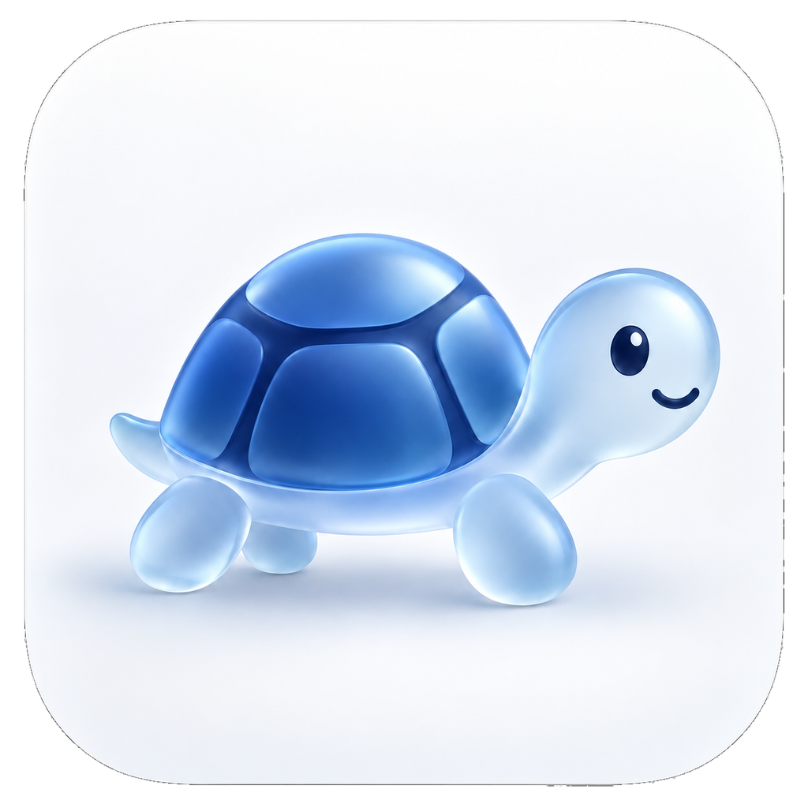
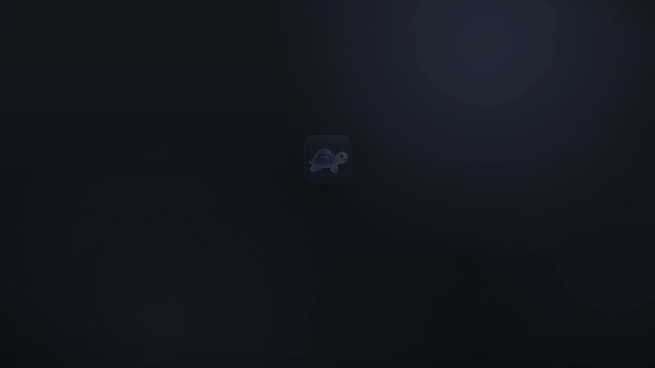

<picture>
  <source media="(prefers-color-scheme: dark)" srcset="docs/assets/app-icon-dark.png">
  
</picture>

# Mr. Usage

Your Claude and OpenAI usage, at a glance. A lightweight macOS menu bar app for Claude Code, Codex, OpenCode, and Pi.

**[Website & leaderboard →](https://usage.beffa.xyz)**

## Features

- **Live plan limits** with reset countdowns and usage pace.
- **Token charts** with input, output, cache usage, and model breakdowns.
- **Estimated API-equivalent costs**—not your subscription bill.
- **OpenAI All devices activity** and additional-usage credit balances.
- **Three themes:** Tokyo Night, Catppuccin Mocha, and Catppuccin Latte.
- **Optional leaderboard sharing**, off by default.
- **Automatic updates** and **Open at Login**.

## Demo

*Example figures shown. macOS 13+ · Apple Silicon and Intel.*
